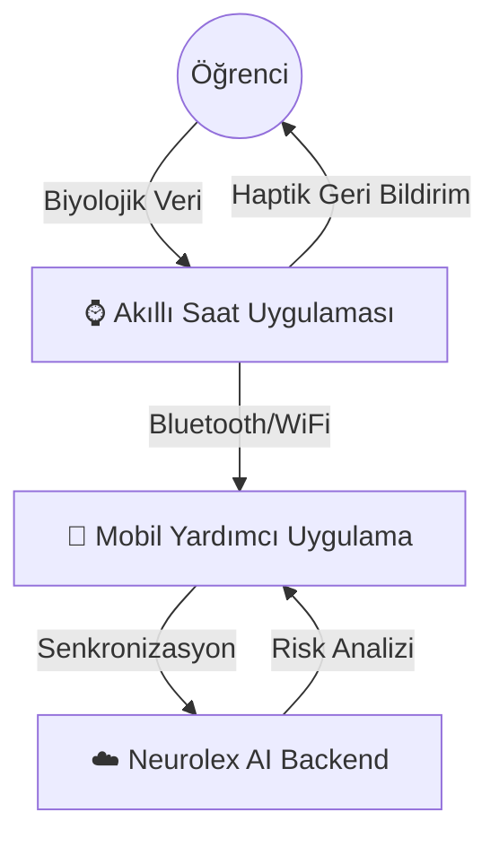

# ⌚ Neurolex: Akıllı Saat Tabanlı Erteleme ve Stres Yönetim Asistanı

> **📽️ [Proje Arayüz Videosunu İzle (Demo)](https://drive.google.com/file/d/1ILQGsIlqzhZ74MhJ7uXUHg4MKnDE0-ga/view?usp=sharing)**

> **TÜBİTAK 2209-A Üniversite Öğrencileri Araştırma Projeleri Destekleme Programı** kapsamında desteklenmektedir.

[](https://opensource.org/licenses/MIT)
[]()
[]()

---

## ⌚ Proje Vizyonu: Bileğinizdeki Psikolojik Asistan

**Neurolex**, üniversite öğrencilerinin erteleme (procrastination) sorununu çözmek için tasarlanmış **giyilebilir yapay zeka** uygulamasıdır. Klasik yöntemlerin aksine, Neurolex sadece bir "yapılacaklar listesi" değildir; o sizin stres seviyenizi anlık olarak izleyen ve kriz anlarında bileğinizden nazikçe sizi uyaran bir biyolojik asistandır.

Projemizin kalbi, akıllı saatinizdir. Biyoteknolojik verileri (Kalp Atış Hızı, HRV) doğrudan bileğinizden okur ve yapay zeka ile işleyerek size **haptik (titreşimli) geri bildirimler** sunar.

> *"Erteleme bir zaman yönetimi sorunu değil, bir duygu yönetimi sorunudur."* - Neurolex, duygularınızı yönetmenize yardımcı olur.

---

## 🌟 Öne Çıkan Özellikler

### 1. 🩸 Gerçek Zamanlı Biyofeedback (Bilekten Takip)
Uygulama, akıllı saatin sensörlerini kullanarak stresin biyolojik işaretlerini (HRV düşüşü, Nabız artışı) sürekli izler.
*   **Stres Tespiti:** Siz fark etmeden önce vücudunuzun verdiği stres tepkilerini algılar.
*   **Odak Modu:** Odaklanma seviyenizi (Flow State) analiz eder.

### 2. 📳 Haptik Uyarı Sistemi (Dürtme Teknolojisi)
Yüksek stres veya erteleme riski algılandığında, saat size özel titreşim desenleri gönderir:
*   **"Nefes Al" Titreşimi:** Nazik, ritmik bir titreşim ile nefes egzersizine davet eder.
*   **"Odaklan" Titreşimi:** Sosyal medyada kaybolduğunuzda sizi uyaran keskin bir uyarı.

### 3. 🌬️ Bilek Üzeri Terapi
Telefona ihtiyaç duymadan, doğrudan saat ekranında:
*   **Animasyonlu Nefes Egzersizleri:** Kare nefes (Box Breathing) animasyonlarını saat ekranında takip edin.
*   **Görsel Sakinleştiriciler:** Mavi/Yeşil ışık terapisi.

---

## 🛠️ Teknik Mimari

Sistem, Akıllı Saat merkezli bir yapıda çalışır:



*   **Wearable App (WearOS/watchOS):** Sensör verilerini okur, anlık grafikleri çizer ve titreşim motorunu yönetir.
*   **Backend (Python/FastAPI):** Uzun vadeli veri analizi ve kişisel model eğitimi yapar.
*   **Dashboard (Streamlit):** Geliştirici ve terapistlerin verileri izlemesi için web arayüzü.

---

## 🧬 Veri Bilimi ve Yapay Zeka Modülü

Projemiz, stres tespiti için gelişmiş makine öğrenimi tekniklerini kullanır. Bu amaçla **`personalizd.ml.for.stress.detection`** submodule'ü projeye entegre edilmiştir.

*   **Özellikler:** Kişiselleştirilmiş stres modelleri, çoklu veri seti analizi (SWELL, WESAD), ve fuzzy clustering.
*   **Detaylar:** Daha fazla bilgi için [ilgili modülün README dosyasını](personalized.ml.for.stress.detection/README.md) inceleyebilirsiniz.

---

## 📸 Prototip ve Simülasyon (MVP)

Şu anda geliştirdiğimiz MVP, akıllı saat donanımını simüle eden gelişmiş bir dashboard içerir.

### Neleri Deneyimleyebilirsiniz?
1.  **Sanal Akıllı Saat Arayüzü:** Dashboard üzerinde canlı çalışan bir saat simülasyonu.
2.  **Stres Senaryoları:** Yapay zeka, stres seviyeniz arttığında saat arayüzünü "Kırmızı Alarm" moduna geçirir.
3.  **Müdahale Testi:** Yüksek risk anında ekranda **"📳 TİTREŞİM AKTİF"** uyarısını görebilirsiniz.

---

## 🚀 Başlangıç Rehberi

Simülasyon ortamını kurmak için:

1.  **Kurulum:**
    ```bash
    git clone https://github.com/bahattinyunus/NeuroDelay.git
    cd NeuroDelay
    pip install -r requirements.txt
    ```

2.  **Başlatma (3 Terminal):**
    *   **Kolay Başlatma (Tek Komut):**
        ```bash
        python run_neurodelay.py
        ```
        Bu komut Backend, Dashboard ve Simülasyonu aynı anda başlatır.

    *   **Manuel Başlatma (Opsiyonel):**
        *   `uvicorn src.software.backend.main:app --reload` (AI Beyni)
        *   `streamlit run src/web/dashboard/app.py` (Görsel Arayüz ve Saat Simülasyonu)
        *   `python -m src.software.simulation.generator` (Sensör Veri Akışı)

---

## 📅 Geliştirme Takvimi

*   [x] **Faz 1:** MVP Prototip ve Simülasyon (Tamamlandı).
*   [x] **Faz 1.5:** İleri Seviye ML Modül Entegrasyonu (Tamamlandı).
*   [ ] **Faz 2:** WearOS / WatchOS Uygulama Geliştirme.
*   [ ] **Faz 3:** Gerçek cihazlarla (Samsung Galaxy Watch / Apple Watch) testler.
*   [ ] **Faz 4:** Üniversite kampüsünde pilot çalışma.

---

## 📞 İletişim

*   **Proje Yürütücüsü:** Bahattin Yunus
*   **Danışman:** [TBD: Danışman Unvan/Ad Soyad]
*   **Üniversite:** [TBD: Üniversite Adı]
